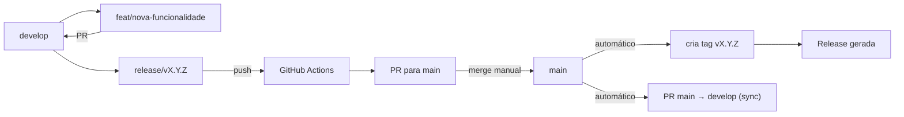
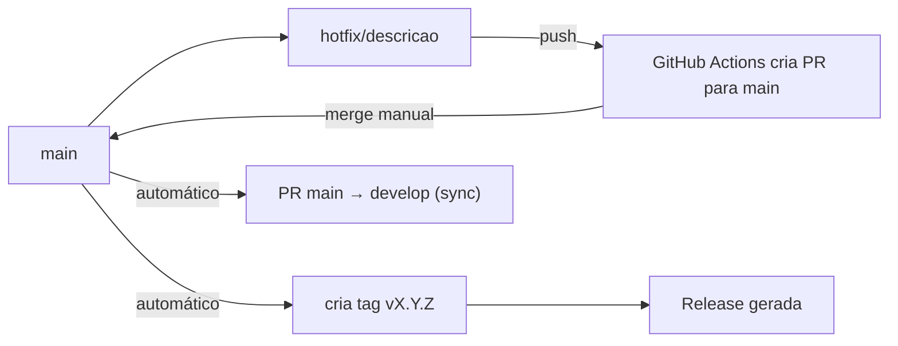

# 🔁 Fluxo de Desenvolvimento e Releases

Este documento descreve o fluxo de trabalho para desenvolvimento de novas funcionalidades (`feature`) e correções urgentes (`hotfix`), utilizando branches protegidas (`develop` e `main`) e automação via GitHub Actions.

---

## 📋 Pré‑requisitos

- **Branches protegidas**: `develop` (desenvolvimento) e `main` (produção). Nenhum push direto é permitido; todas as alterações devem ser feitas via **Pull Requests (PRs)**.
- **GitHub Actions configuradas**:
  - `release-pr.yml`: cria PR de `release/*` → `main`
  - `hotfix-pr.yml`: cria PR de `hotfix/*` → `main`
  - `tag-on-merge.yml`: cria tag automaticamente após merge na `main`
  - `sync-develop.yml` (opcional): cria PR de `main` → `develop` para sincronização
- **Workflow de Release existente** (acionado por tags `v*`) – gera changelog e publica release no GitHub.
- **Segredo `GH_PAT`**: Personal Access Token com escopos `repo`, `workflow` (e `write:org` se aplicável) configurado no repositório.

---

## 1. 🚀 Desenvolvimento de Feature



```text
Feature (normal)
----------------
develop → feat/nova-funcionalidade → PR → develop → release/vX.Y.Z → push
              ↓ (push da release)
         GitHub Actions cria PR para main
              ↓ (merge manual)
         main → tag vX.Y.Z → release → PR main → develop (sync)
```

### Passos detalhados

1. **Criar branch de feature** a partir da `develop`:

   ```bash
   git checkout develop
   git pull origin develop
   git checkout -b feat/nome-da-feature
   ```

2. **Desenvolver e commitar** (use `npm run commit` para padronização):

   ```bash
   npm run commit
   ```

3. **Enviar branch e abrir PR** para `develop` (manualmente no GitHub).  
   Após aprovação, fazer o merge.

4. **Quando a `develop` estiver pronta para lançar**, criar uma **branch de release**:

   ```bash
   git checkout develop
   git checkout -b release/vX.Y.Z      # Ex: release/v1.2.0
   ./bump-version.sh patch             # opcional, mas recomendado
   git push origin release/vX.Y.Z
   ```

5. O **GitHub Actions** criará automaticamente um PR de `release/vX.Y.Z` → `main`.
   - Revise o PR, verifique as alterações e faça o **merge manual** (exige aprovação).

6. **Após o merge** na `main`, o workflow `tag-on-merge.yml` criará a tag `vX.Y.Z`.
   - A tag dispara o workflow `Release`, que gera a **Release no GitHub** com changelog automático.
   - (Opcional) O workflow `sync-develop.yml` criará um PR de `main` → `develop` para manter as branches sincronizadas.

7. **Atualize sua `develop` local** (após o merge do PR de sync ou manualmente):

   ```bash
   git checkout develop
   git pull origin develop
   ```

---

## 2. 🧯 Hotfix (Correção Urgente)



---

```text
Hotfix
------
main → hotfix/descricao → push → GitHub Actions cria PR para main
              ↓ (merge manual)
         main → tag vX.Y.Z → release → PR main → develop (sync)
```

### Passos detalhados

1. **Criar branch de hotfix** a partir da `main`:

   ```bash
   git checkout main
   git pull origin main
   git checkout -b hotfix/descricao-do-problema
   ```

   - Se desejar incrementar a versão automaticamente, use `hotfix/vX.Y.Z` (ex.: `hotfix/v1.2.4`).

2. **Implementar a correção** e commitar:

   ```bash
   npm run commit
   ```

3. **Enviar branch**:

   ```bash
   git push origin hotfix/descricao-do-problema
   ```

4. O **GitHub Actions** criará um PR de `hotfix/*` → `main`.
   - Revise e faça o **merge manual** (exige aprovação).

5. **Após o merge** na `main`, o workflow `tag-on-merge.yml` detectará a versão (se presente no nome da branch ou no commit) e criará a tag `vX.Y.Z`.
   - A Release será gerada automaticamente.
   - Um PR de `main` → `develop` será criado para sincronização (se ativado).

6. **Sincronize a `develop`** (se necessário):

   ```bash
   git checkout develop
   git merge main      # ou faça merge via PR automático
   ```

---

## ⚙️ Configuração dos Workflows (resumo)

Os arquivos YAML estão em `.github/workflows/` e podem ser ajustados conforme necessidade. Os principais são:

| Workflow           | Gatilho             | Ação                              |
| ------------------ | ------------------- | --------------------------------- |
| `release-pr.yml`   | push em `release/*` | Cria PR para `main`               |
| `hotfix-pr.yml`    | push em `hotfix/*`  | Cria PR para `main`               |
| `tag-on-merge.yml` | push em `main`      | Cria tag a partir do merge commit |
| `sync-develop.yml` | push em `main`      | Cria PR de `main` → `develop`     |

> **Nota:** Para que os workflows funcionem, o segredo `GH_PAT` deve estar configurado no repositório (Settings → Secrets and variables → Actions).

---

## 📌 Boas Práticas

- **Nunca faça push direto** para `develop` ou `main` – use sempre Pull Requests.
- **Commits padronizados** com `npm run commit` para manter o histórico limpo e o `commitlint` feliz.
- **Revise os PRs** antes de fazer o merge – as branches são protegidas e exigem aprovação.
- **Teste localmente** antes de criar uma branch de release ou hotfix.
- **Mantenha a `develop` sincronizada** com a `main` após cada release (os workflows podem ajudar, mas verifique).

---

## 🔁 Fluxo Simplificado (comandos do dia a dia)

### Desenvolvimento normal

```bash
git checkout develop
git checkout -b feat/minha-feature
# desenvolva e commit
git push origin feat/minha-feature
# abrir PR no GitHub (feat → develop)
# após merge, criar release:
git checkout develop
git checkout -b release/v1.2.0
git push origin release/v1.2.0
# aguardar PR automático e fazer merge manual
```

### Hotfix

```bash
git checkout main
git checkout -b hotfix/v1.2.1
# corrija e commit
git push origin hotfix/v1.2.1
# aguardar PR automático e fazer merge manual
```

---

Com esse fluxo, você mantém a qualidade do código, rastreabilidade e automação sem perder o controle sobre as aprovações. 🚀
